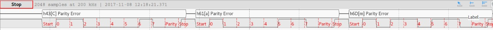

# Projeto 9 - Serialização/Desserialização

## Comunicação UART

## Exibir a forma de onda gerada pela implementação (usando o analog discovery)

A mensagem a ser transmitida era: `Cam Fisica Rapha e Elisa`, assim a forma de onda gerada pelo envio dos três primeiros caracteres é representado na imagem abaixo.

## Explicar o código

